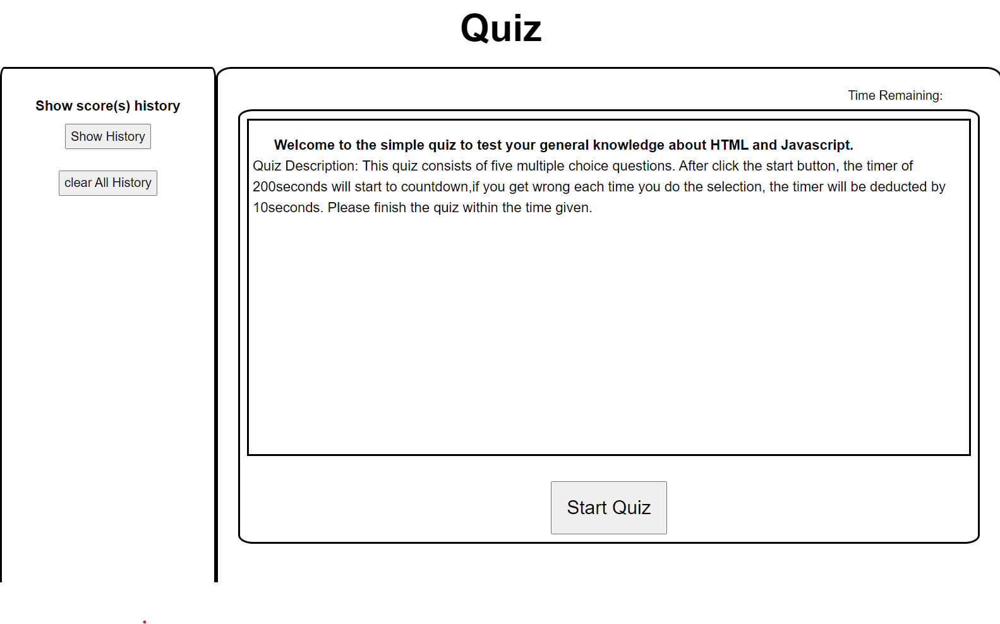
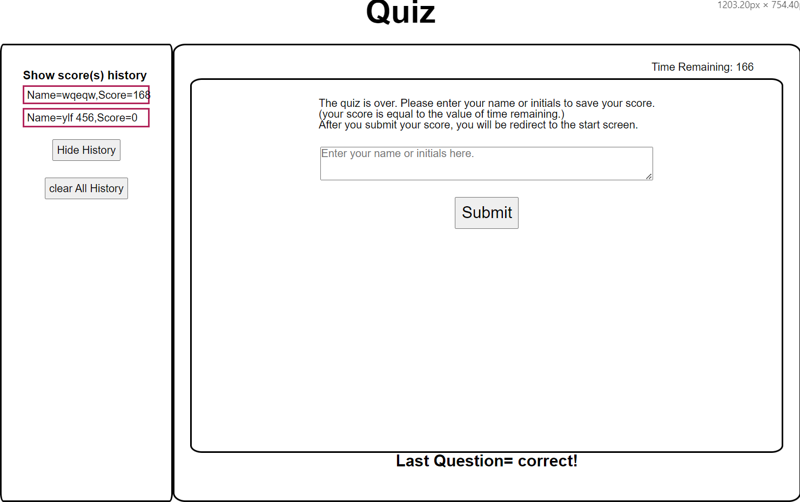

# Simple Quiz

## Description

This quiz webpage, functional with minimum styling using HTML, CSS, and Javascript, was created by Yilun Fan for study use.

## Installation

N/A

## Usage

This simple quiz consists of five multiple-choice questions. After you click the start button on the starting screen, the timer of 200 seconds will start to countdown. If you did wrong in the questions, the time remaining will be deducted by 10 seconds. After you complete all questions, you will be asked to enter your name or initials in a form. When you click the submit button, your name and your score (time remaining) will be stored in local storage, which will persist and rendered even if you refresh the page. The score history in the initial state is hidden until you click the "show history" button. You can also hide the score history by clicking the "hide history" button and clear the score history and score history data stored in the local storage by clicking the "clear all history" button.

## Credits

The quiz questions in the HTML were pulled from here: https://www.w3schools.com/quiztest/quiztest.asp?qtest=JS

## License

N/A

## Link to this application

https://github.com/ylf456/week-4-challenge-ylf456.git

https://ylf456.github.io/week-4-challenge-ylf456/

## Screenshots

